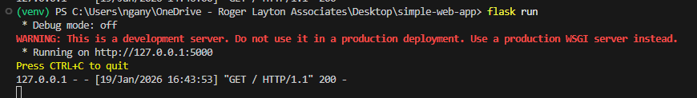
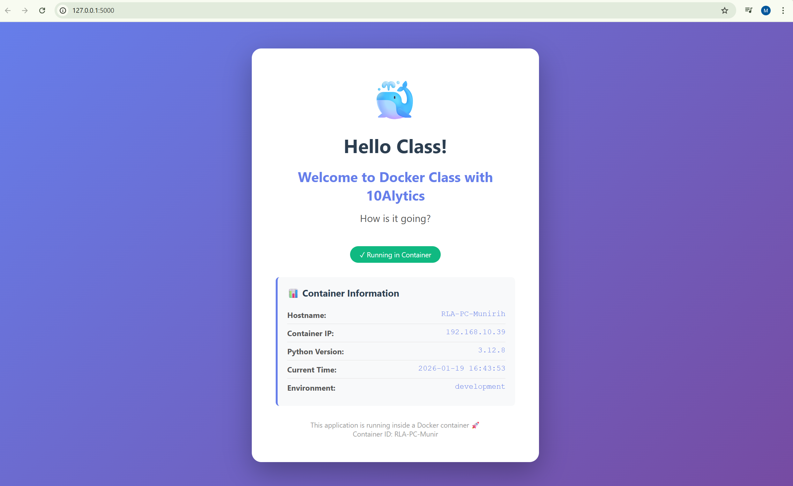
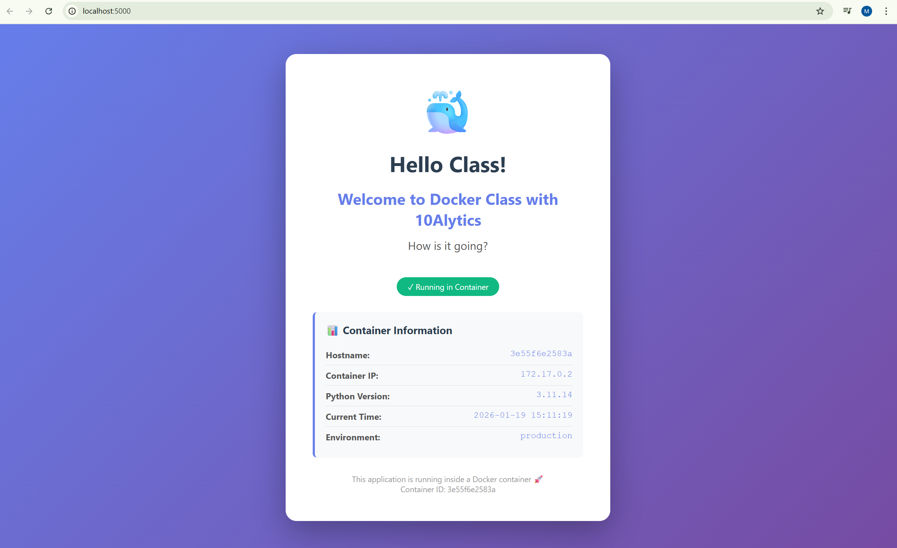
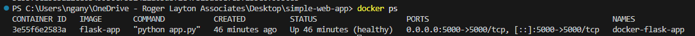

# Simple Flask App

Below are the steps to run the app on the local machine and how to run it as a docker container.

## Prerequisites

- Python 3.11 or newer versions installed in your local machine.
- Docker Desktop

### Step 1: Dowload the zip file and unzip into your local machine

Open the folder in VSCode

### Step 2: Create a virtual environment and activate the virtual environment

- Open the terminal and run the following command:

python -m venv venv

- Activate the virtual environment by running the following command:

venv\Scripts\activate

### Step 3: Install the python python packages needed to run the application

- Run the following command to install the dependencies contained in the requirements.txt file:

python install -r requirements.txt

### Step 4: Run the flask development Server to serve the flask app

- The following command will run the flask development server:

flask run 

The output is as seen in the picture below.

- press Ctrl + click http://127.0.0.1:5000 to view the app in your browser as seen in the image below:

### Step 5: Build the docker image 

- Run the following command to build a docker image:
  
docker build -t <docker_image_name> . 

- Once the image has been successfully built, you will need to run the image in a container. Type the command:

docker run -d -p <host-port>:<container_port> --name <container_name> <docker_image_name>

Host_port: 5000 the app runs locally
Container_port: 5000 as specified in the dockerfile

- Running container 

